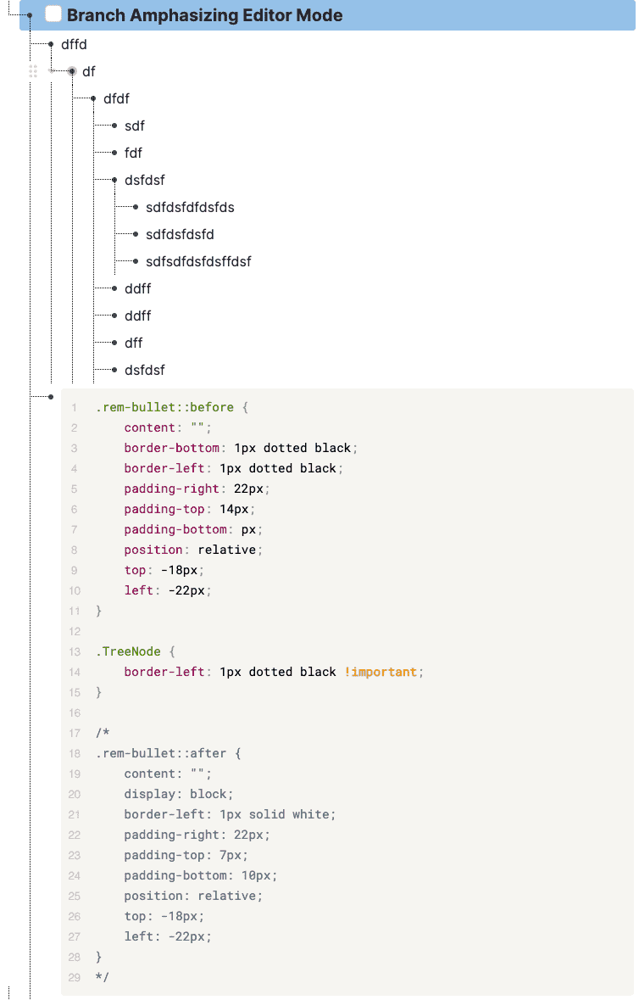
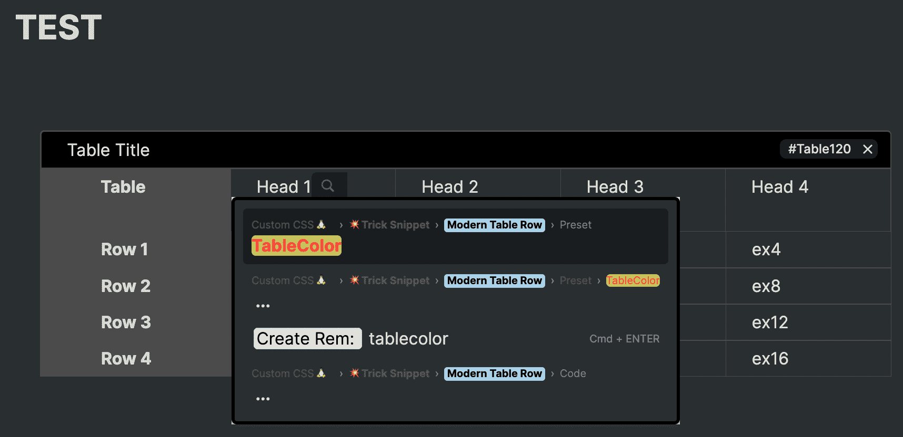
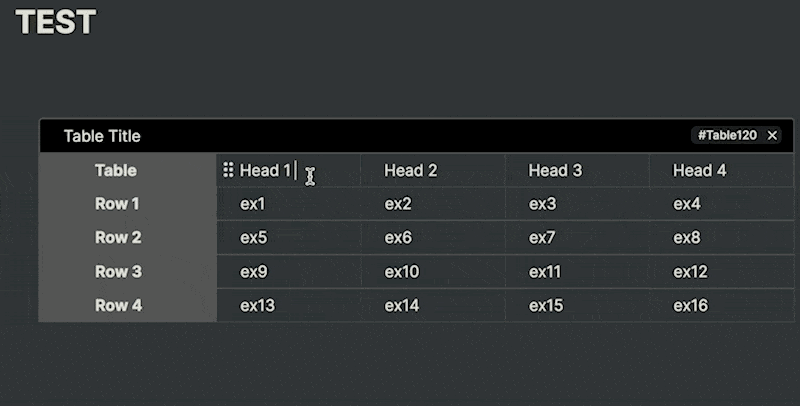

# How to Use it?

Please check the [Custom CSS Tutorial](https://forum.remnote.io/t/what-is-custom-css-and-how-do-i-use-it/1231) first

## The Standard Way

- Click the css file and copy the text.

## The Simpler Way

- Copy the CSSs started with `@import` down below

↓

Go back to your Knowledge Base. And then, Paste the clipboard into the Custom CSS power-up page Code Block in which the language button adjusted to CSS. (The latter way makes Your Custom CSS always up to date.)

> PS: All the latest snippets are optimized for `Modern Dark Theme`

# Theme

<details>
    <summary>Modern Dark Theme</summary>

```css
@import url("https://browneyedsoul.github.io/RemNote-CSS-Library/Modern%20Dark%20Theme.css");
```

## Hidden Features

- Turning Highlight Color into Text Color
  - You can change the Highlight color to normal rem-text color by [ Tagging the `color` tag + Bolding text ]
  - But You don't have to tag the `color` tag to Header 1,2,3
- Displaying Long Page Breadcrumbs with scroll bar
<div style="margin-left: 24px;">
  
  
  
  
</div>
</details>

# Editor Mode

<details>
    <summary>Notion like No Bullet Editor Mode</summary>

```css
@import url("https://browneyedsoul.github.io/RemNote-CSS-Library/Notion%20like%20No%20Bullet%20Editor%20Mode.css"); 
```

<div style="margin-left: 24px;">
    <ul>
        <li>For those who are thinking that Bullet-based Outliner Editor is way too cluttered with crowded bullet points.</li>
        <li>Combined UX : Block based Notion Editor + Outliner</li>
    </ul>
    <h2>Use case</h2>
    
    
    
</div>
</details>

<details>
    <summary>Branch Emphasizing Editor Mode(need to be polished)</summary>

```css
@import url("https://browneyedsoul.github.io/RemNote-CSS-Library/Branch%20Emphasizing%20Mode.css"); 
```

<div style="margin-left: 24px;">
    
</div>
</details>

# Tricks

<details>
    <summary>Modern Scrollable Codeblock</summary>

```css
 @import url("https://browneyedsoul.github.io/RemNote-CSS-Library/Modern%20Scrollable%20Code%20Block.css");
```

<div style="margin-left: 24px;">
    
    
</div>
</details>

<details>
    <summary>Rem Thumbnail</summary>

```css
@import url("https://browneyedsoul.github.io/RemNote-CSS-Library/Rem%20Thumbnail.css");
```

<div style="margin-left: 24px;">
    <h2>Use case</h2>
    
    
</div>
</details>

# Tricks - Tag-related Gimmick series

<details>
    <summary>Notion like Callout Rem</summary>

```css
@import url("https://browneyedsoul.github.io/RemNote-CSS-Library/Notion%20like%20Callout%20Rem.css");
```

<div style="margin-left: 24px;">
    
    
</div>
</details>

<details>
    <summary>Modern Divider</summary>

```css
@import url("https://browneyedsoul.github.io/RemNote-CSS-Library/Modern%20Divider.css"); 
```

<div style="margin-left: 24px;">
    
    
</div>
</details>

<details>
    <summary>Active Recall</summary>

```css
@import url("Assets/ActiveRecall.gif");
```

<div style="margin-left: 24px;">
    
</div>
</details>

<details>
    <summary>Blockquote</summary>

```css
@import url("https://browneyedsoul.github.io/RemNote-CSS-Library/Blockquote.css");
```

<div style="margin-left: 24px;">
    <h2>Use case</h2>
    
<div>
</details>

<details>
    <summary>Modern Table Row</summary>

```css
@import url("https://browneyedsoul.github.io/RemNote-CSS-Library/Modern%20Table%20Row.css");
```

<div style="margin-left: 24px;">
    <div style="font-size: 24px; font-weight: 700;">Feature</div>
    <div>    
        <details>
            <summary>Column Width Adjustment by Tagging to the Title bar</summary>
            
            
        </details>
    </div>
    <div>
        <details>
            <summary>Hacky Method : Changing Row table cell to Use as a Column Table cell</summary>
            
        </details>
    </div>
    <div>
        <details>
            <summary>Convert Spreadsheet Table into RemNote Format Workaround</summary>
            
            
            
            
            
            
            
            
            
            
        </details>
    </div>
</div>
</details>

<details>
    <summary>Modern Table Column</summary>

```css
@import url("https://browneyedsoul.github.io/RemNote-CSS-Library/Modern%20Table%20Column.css");
```


</details>

<details>
    <summary>Easily Discernible Inline Card Layout</summary>

```css
@import url("https://browneyedsoul.github.io/RemNote-CSS-Library/Easily%20Discernible%20Inline%20Card%20layout.css");
```

<div>
    <ul>
        <h2>Before</h2>
        <br>
        <h2>After</h2>
        <br>
        <br>
    </ul>
</div>
</details>

<details>
    <summary>Strikethrough Workaround</summary>

```css
@import url("https://browneyedsoul.github.io/RemNote-CSS-Library/Strikethrough.css");
```


</details>

<details>
    <summary>Caption</summary>

```css
@import url("https://browneyedsoul.github.io/RemNote-CSS-Library/Image%2C%20Codeblock%20Caption%20like%20in%20Notion.css");
```


</details>

<details>
    <summary>Rating bar</summary>

```css
@import url("https://browneyedsoul.github.io/RemNote-CSS-Library/Prepositive%20Rating%20Bar.css"); 
```


</details>

<details>
    <summary>Cover Photo</summary>

```css
/* @import url("https://browneyedsoul.github.io/RemNote-CSS-Library/"); */
/* Please Copy the .css file and paste to your KB Directly */
```

<div style="margin-left: 24px;">
    <details>
        <summary>Make CSS Template on Custom CSS</summary>
        <div style="margin-left: 24px;">
            
        </div>
    </details>
    <details>
        <summary>Add image url, Name the tag</summary>
        <div style="margin-left: 24px;">
            
        </div>
    </details>
    <details>
        <summary>Tag to the Rem-title</summary>
        <div style="margin-left: 24px;">
            
            
        </div>
    </details>
    <details>
        <summary>Adjust <span style="font-weight: 700;">background-size</span> on your tastes.</summary>
        <div style="margin-left: 24px;">
            <br>➊ background-size: contain; <span style="font-weight: 700;">(Preferred)</span> ➞ Height fixed and Responsive. but some margins can be made (need something like background color or repetitive background.).
            <br>➋ background-size: 100% 100%; ➞ Full responsive but the image can be ugly.
            <br>➌ background-size: cover; ➞ I don’t care about the cover image cropped.
        </div>
    </details>
</div>
</details>

<details>
    <summary>Terminal</summary>

```css
@import url("https://browneyedsoul.github.io/RemNote-CSS-Library/Terminal.css");
```


</details>

<details>
    <summary>UI Declutter Series</summary>

```css
@import url("https://browneyedsoul.github.io/RemNote-CSS-Library/UI%20Declutter%20Series/RemNote%20UIUX-Declutter.css");
```

<div style="margin-left: 24px;">
    <details>
        <summary>Hide Placeholder aka "Type / for Commands"</summary>
        
        
    </details>
    <details>
        <summary>Declutter ? Button at the right bottom</summary>
        
    </details>
    <details>
        <summary>Disable inadvertent Bullet Click Event</summary>
    </details>
    <details>
        <summary>Hide List Card Arrow</summary>
        
    </details>
    <details>
        <summary>Hide List Card Placeholder</summary>
        
        
    </details>
</div>
</details>

# The SUM of all the Theme and Snippets

```css
/* Modern Dark Theme */
 @import url("https://browneyedsoul.github.io/RemNote-CSS-Library/Modern%20Dark%20Theme.css");
/* Editor Mode */
 /* Notion like No Bullet Editor Mode */
  @import url("https://browneyedsoul.github.io/RemNote-CSS-Library/Notion%20like%20No%20Bullet%20Editor%20Mode.css"); 
 /* Branch Emphasizing Editor Mode(need to be polished) */
  /* @import url("https://browneyedsoul.github.io/RemNote-CSS-Library/"); */
/* Tricks */
 /* Modern Scrollable Codeblock */
  @import url("https://browneyedsoul.github.io/RemNote-CSS-Library/Modern%20Scrollable%20Code%20Block.css");
 /* Rem Thumbnail */
  @import url("https://browneyedsoul.github.io/RemNote-CSS-Library/Rem%20Thumbnail.css");
 /* Notion like Callout Rem */
  @import url("https://browneyedsoul.github.io/RemNote-CSS-Library/Notion%20like%20Callout%20Rem.css");
 /* Modern Divider */
  @import url("https://browneyedsoul.github.io/RemNote-CSS-Library/Modern%20Divider.css"); 
 /* Active Recall */
  @import url("https://browneyedsoul.github.io/RemNote-CSS-Library/Active%20Recall.css");
 /* Blockquote */
  @import url("https://browneyedsoul.github.io/RemNote-CSS-Library/Blockquote.css");
 /* Modern Table Row */
  @import url("https://browneyedsoul.github.io/RemNote-CSS-Library/Modern%20Table%20Row.css");
 /* Modern Table Column */
  @import url("https://browneyedsoul.github.io/RemNote-CSS-Library/Modern%20Table%20Column.css");
 /* Easily Discernible List Card Layout */
  /* @import url("https://browneyedsoul.github.io/RemNote-CSS-Library/Easily%20Discernible%20List%20Card%20Layout.css"); */
 /* Easily Discernible Inline Card Layout */
  @import url("https://browneyedsoul.github.io/RemNote-CSS-Library/Easily%20Discernible%20Inline%20Card%20layout.css");
 /* Strikethrough Workaround */
  @import url("https://browneyedsoul.github.io/RemNote-CSS-Library/Strikethrough.css");
 /* Caption */
  @import url("https://browneyedsoul.github.io/RemNote-CSS-Library/Image%2C%20Codeblock%20Caption%20like%20in%20Notion.css");
 /* Rating Bar */
  @import url("https://browneyedsoul.github.io/RemNote-CSS-Library/Prepositive%20Rating%20Bar.css"); 
 /* Terminal */
    @import url("https://browneyedsoul.github.io/RemNote-CSS-Library/Terminal.css");
 /* UI Declutter Series */
  @import url("https://browneyedsoul.github.io/RemNote-CSS-Library/UI%20Declutter%20Series/RemNote%20UIUX-Declutter.css");
```
