# How to Use it?

1. Please check the [Custom CSS Tutorial](https://forum.remnote.io/t/what-is-custom-css-and-how-do-i-use-it/1231) first

2. Copy the CSSs started with `@import` down below

3. Go back to your Knowledge Base. And then, paste the clipboard into a Custom CSS power-up page Code Block in which the language button is tuned to CSS.

> PS: All the latest snippets are optimized for `Modern Dark Theme`

# Theme
<!-- Modern Dark Theme -->
 <details>
    <summary>Modern Dark Theme</summary>

 ```css
 @import url("https://browneyedsoul.github.io/RemNote-CSS-Library/Modern%20Dark%20Theme.css");
 ```

 ## Hidden Features

 <div>
    <details>
        <summary>Turning Highlight Color into Text Color</summary>
        <br>
        You can change a Highlight color to a text color by simple bolding
        <br>
        <br>
        
    </details>
 </div>
 <div>
    <details>
        <summary>Displaying Long Page Breadcrumbs with scroll bar</summary>
        <br>
        
    </details>
 </div>

 ## Display

 <div style="margin-left: 24px;">
    
    
    
    
    
    
    
    
 </div>
 </details>

 ---
 <br>
 <br>

# Editor Mode

<!-- No Bullet Editor Mode -->
 <details>
    <summary>No Bullet Editor Mode</summary>

 ```css
 @import url("https://browneyedsoul.github.io/RemNote-CSS-Library/Notion%20like%20No%20Bullet%20Editor%20Mode.css"); 
 ```

 <div style="margin-left: 24px;">
    <details>
        <summary>What is the purpose of this snip?</summary>
            <ul>
                <li>For those who are thinking that Bullet-based Outliner Editor is way too cluttered with crowded bullet points.</li>
                <li>Combined UX : Notion like Block based Editor + Outliner</li>
            </ul>
    </details>
    <details>
        <summary>If you need bullet points, Make them by tagging `bulletlist`</summary>
        
    </details>
    <details>
        <summary>And if you want just one tag for bulleted children, you can use `bulletlists`</summary>
        
    </details>
    <details>
        <summary>Use case</summary>
        
        
        
        
    </details>
 </div>
 </details>

 ---
 <br>
 <br>

# Tricks

<!-- Modern Scrollable Codeblock -->
 <details>
    <summary>Modern Scrollable Codeblock</summary>

 ```css
 @import url("https://browneyedsoul.github.io/RemNote-CSS-Library/Modern%20Scrollable%20Code%20Block.css");
 ```

 <div style="margin-left: 24px;">
    
    
    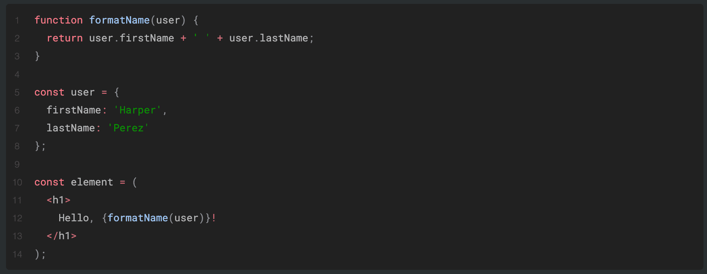
 </div>
 </details>

 ---

<!-- Rem Thumbnail -->
 <details>
    <summary>Rem Thumbnail</summary>

 ```css
 @import url("https://browneyedsoul.github.io/RemNote-CSS-Library/Rem%20Thumbnail.css");
 ```

 <div style="margin-left: 24px;">
    <h2>Use case</h2>
    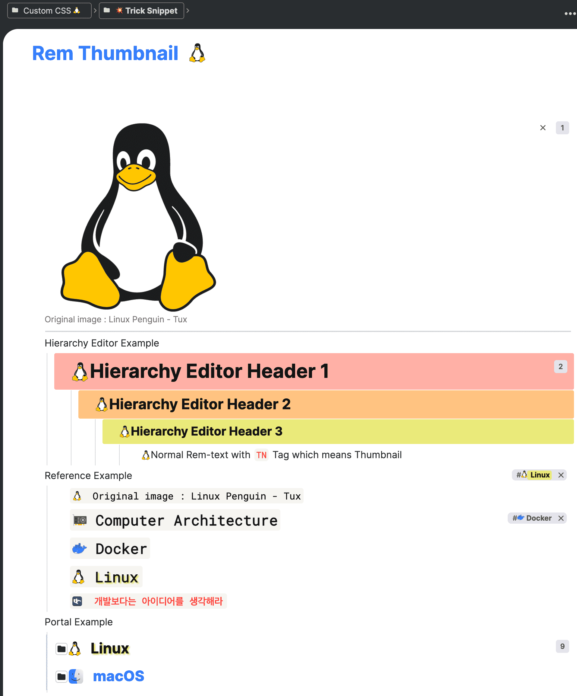
 </div>

 - I'd recommend you to use Rem Thumbnail with a rem-reference, which image is saved somewhere else in the workspace neatly like this.
 

 </details>

 ---
 <br>
 <br>

# Tricks - Tag-related Gimmick Series

<!-- NOTICE : Good Companion Apps for Easy-Tagging -->
 <details>
    <summary>NOTICE : Good Companion Apps for Easy-Tagging</summary>


 | OS  | Text Expansion Tools |
 | ------------- | ------------- |
 | Windows  | AutoHotkey, espanso  |
 | macOS  | Keyboard Maestro, espanso  |
 | Linux  | AutoKey, espanso  |

 - The above list is just an example. You can find more apps online.
 - <a href="https://forum.remnote.io/t/remnote-templates-vs-text-templates/1203">And more details about it. - RemNote Forum</a>

 </details>

 ---

<!-- Callout Rem -->
 <details>
     <summary>Callout Rem</summary>

 ```css
 @import url("https://browneyedsoul.github.io/RemNote-CSS-Library/Notion%20like%20Callout%20Rem.css");
 ```

 <div style="margin-left: 24px;">
    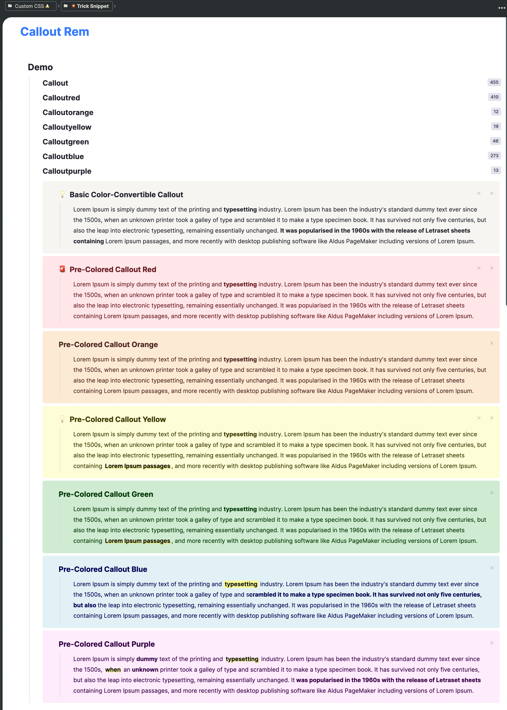
    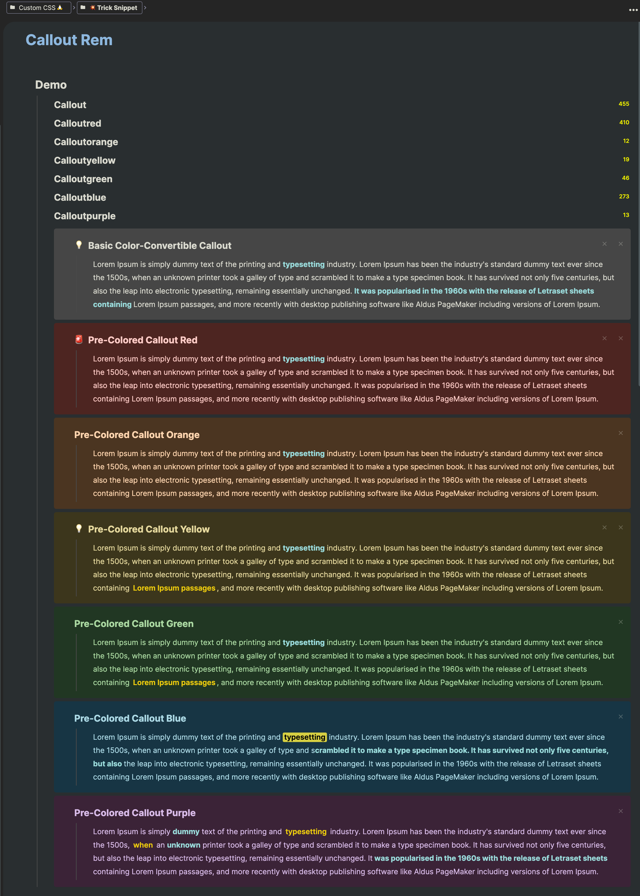
    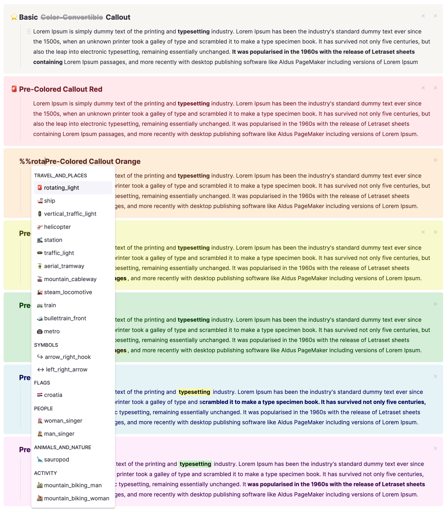
 </div>
 </details>

 ---

<!-- Modern Divider -->
 <details>
    <summary>Modern Divider</summary>

 ```css
 @import url("https://browneyedsoul.github.io/RemNote-CSS-Library/Modern%20Divider.css"); 
 ```

 <div style="margin-left: 24px;">
    
    
 </div>
 </details>

 ---

<!-- Active Recall -->
 <details>
    <summary>Active Recall</summary>

 - Tag Name : `active recall`  (NOT the `active-recall`)
 <details>
    <summary>Ver.1 - Reveal all the Answer-blocks in a List card Answer at the same time</summary>
 
 ```css
 @import url("https://browneyedsoul.github.io/RemNote-CSS-Library/Active%20Recall.css");
 ```

 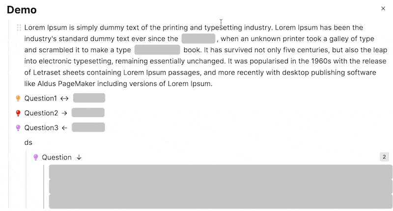
 </details>
 
 <details>
    <summary>Ver.2 - Active Recall in all situation. even in a Flashcard Review modal page and a 'Edit your flashcard' popup</summary>

 ```css
 @import url("https://browneyedsoul.github.io/RemNote-CSS-Library/Active%20Recall2.css");
 ```

 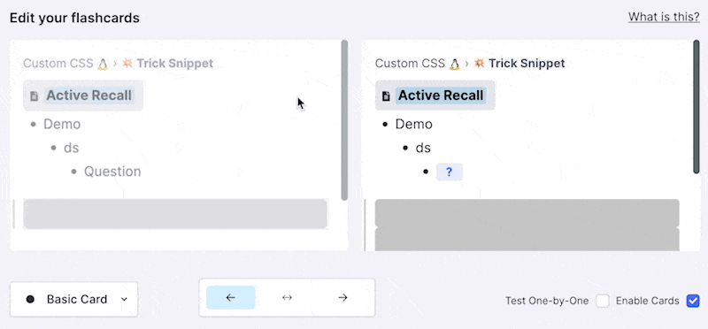
 </details>
 
 <details>
    <summary>Ver.3 - Legacy Mode (Show List-card Answer-blocks one by one)</summary>
    
 ```css
 @import url("https://browneyedsoul.github.io/RemNote-CSS-Library/Active%20Recall3.css");
 ```

 
 </details>

 <a href="https://hannesfrank.github.io/remnote-library/#/scroll/com.github.hannesfrank.remnote-library.active-recall">origin author : hannesfrank</a>
 
 </details>

 ---

<!-- Rem Planner -->
 <details>
    <summary>Rem Planner</summary>

 ```css
 @import url("https://browneyedsoul.github.io/RemNote-CSS-Library/Planner.css");
 ```

 <div style="margin-left: 24px;">
    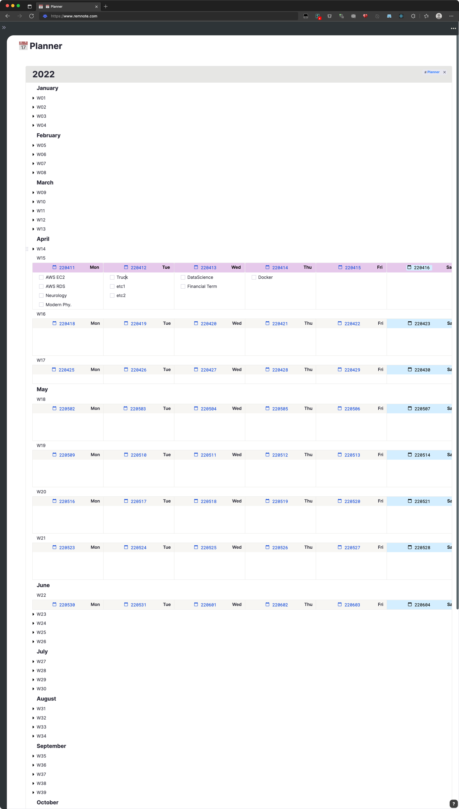
 </div>
 </details>

 ---

<!-- Rem Tree -->
 <details>
    <summary>Rem Tree</summary>

 ```css
 @import url("https://browneyedsoul.github.io/RemNote-CSS-Library/Rem%20Tree.css");
 ```

 <ul>
     <li>Tag Name : Tree</li>
 </ul>
 <div style="margin-left: 24px;">
     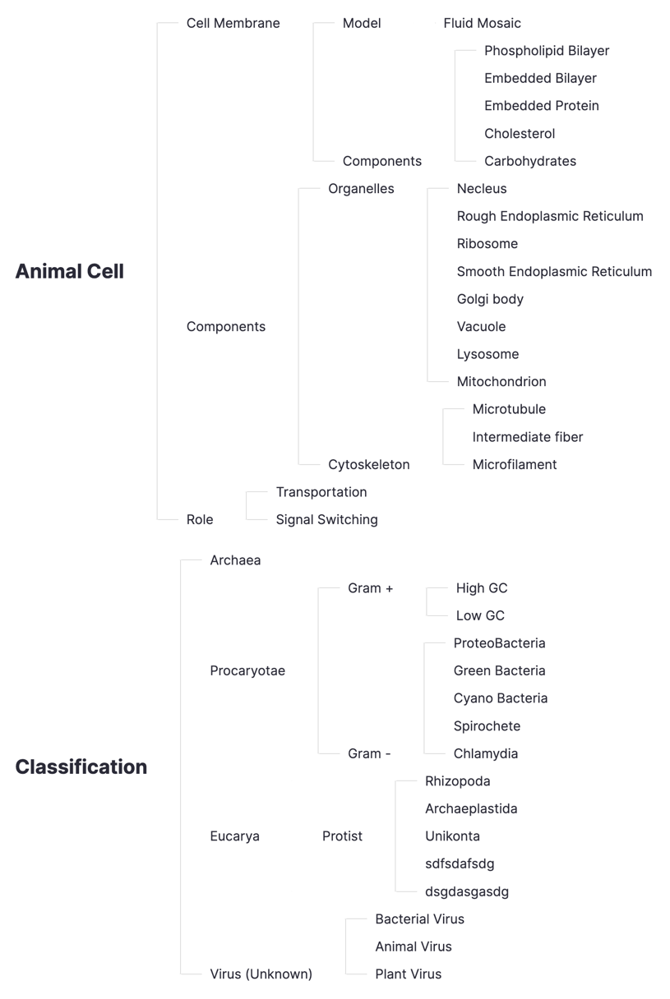
 </div>
 </details>
 
 ---

<!-- Blockquote -->
 <details>
    <summary>Blockquote</summary>

 ```css
 @import url("https://browneyedsoul.github.io/RemNote-CSS-Library/Blockquote.css");
 ```
 
 - Tag Name : `blockquote`

 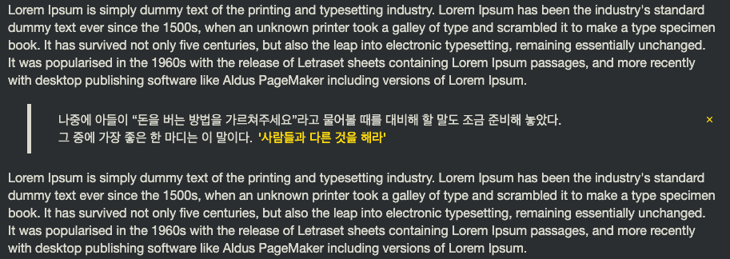
 
 </details>

 ---

<!-- Modern Table Row -->
 <details>
    <summary>Modern Table Row ⭐️</summary>

 ```css
 @import url("https://browneyedsoul.github.io/RemNote-CSS-Library/Modern%20Table%20Row.css");
 ```
 
 ## Display

 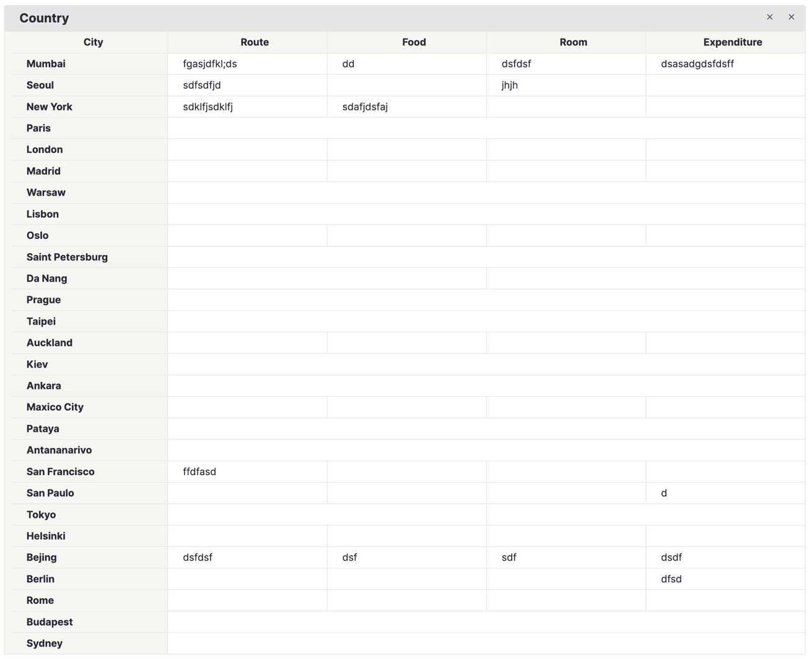
 
 ## How to make Modern Table Row

 
 - You have to select one of the widths listed below first to make a `Modern Table Low`
 - From 90px to 1200px, 30px interval

 - Available Left Column Width List

 | Table Left Column Width | Available Tag Name |
 | ------------- | ------------- |
 | 90px | `Table90` |
 | 120px | `Table120` |
 | 150px | `Table150` |
 | 180px | `Table180` |
 | 210px | `Table210` |
 | ...   |   ...    |
 | 1170px | `Table1170` |
 | 1200px | `Table1200` |
 

 ## Table Tuning by Tagging to the Title Bar

 <details>
    <summary>Tuning Global Column Width</summary>

 | Table Left Column Width | Tag Name for global width tuning |
 | ------------- | ------------- |
 | 90px | `W90` |
 | 120px | `W120` |
 | 150px | `W150` |
 | 180px | `W180` |
 | 210px | `W210` |
 | ...   |   ...    |
 | 1170px | `W1170` |
 | 1200px | `W1200` |

 
 
 </details>

 <details>
    <summary>Tuning Individual Column Width</summary>

 - 'c1' means column 1
 - 'c2' means column 2
 - ...

 | Available Column Width | Tag Name for width tuning - INDIVIDUAL column |
 | ------------- | ------------- |
 | 200px | `c1w200`, `c2w200`, `c3w200`, `c4w200`, `c5w200`, ... , `c9w200`  |
 | 400px | `c1w400`, `c2w400`, ... `c9w400`  |
 | 600px | `c1w600`, `c2w600`, ... `c9w600` |
 | 800px | `c1w800`, `c2w800`, ... `c9w800` |
 | 1000px | `c1w1000` `c2w1000`,, ... `c9w1000` |

 </details>

 <details>
    <summary>Table width shrinking to fit with inner contents</summary>
 
 - Tag Name : `fit`

 
 
 </details>

 

 <details>
   <summary>Table Column Header Formatting</summary>

 - Tag Name : `th`

 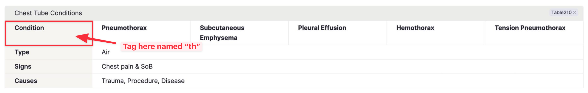
 </details>

 ## Use case

 <details>
    <summary>Copy a Table from any sources</summary>
    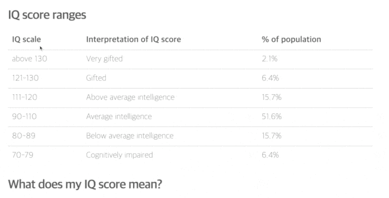
 </details>

 <details>
    <summary>Paste it to RemNote and Tag the predefined-width Table Row Tags to the Table Title area</summary>
    
 </details>


 ## Hacky methods

 <details>
    <summary>Turn a Row table cell into a Column Table cell</summary>

 - Tag Nmae : `lb`

 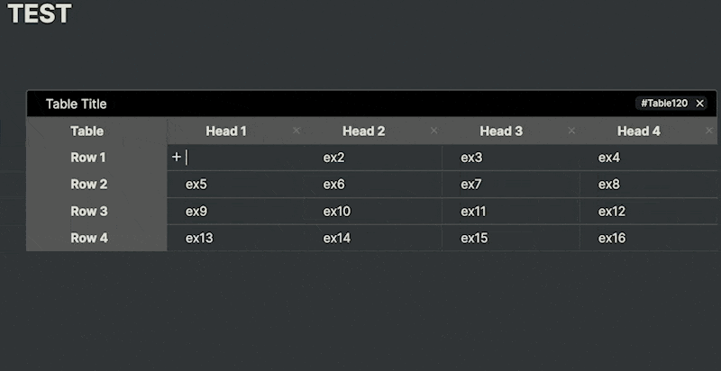
    
 </details>
 <details>
    <summary>Convert Spreadsheet Table into RemNote Format Workaround</summary>
    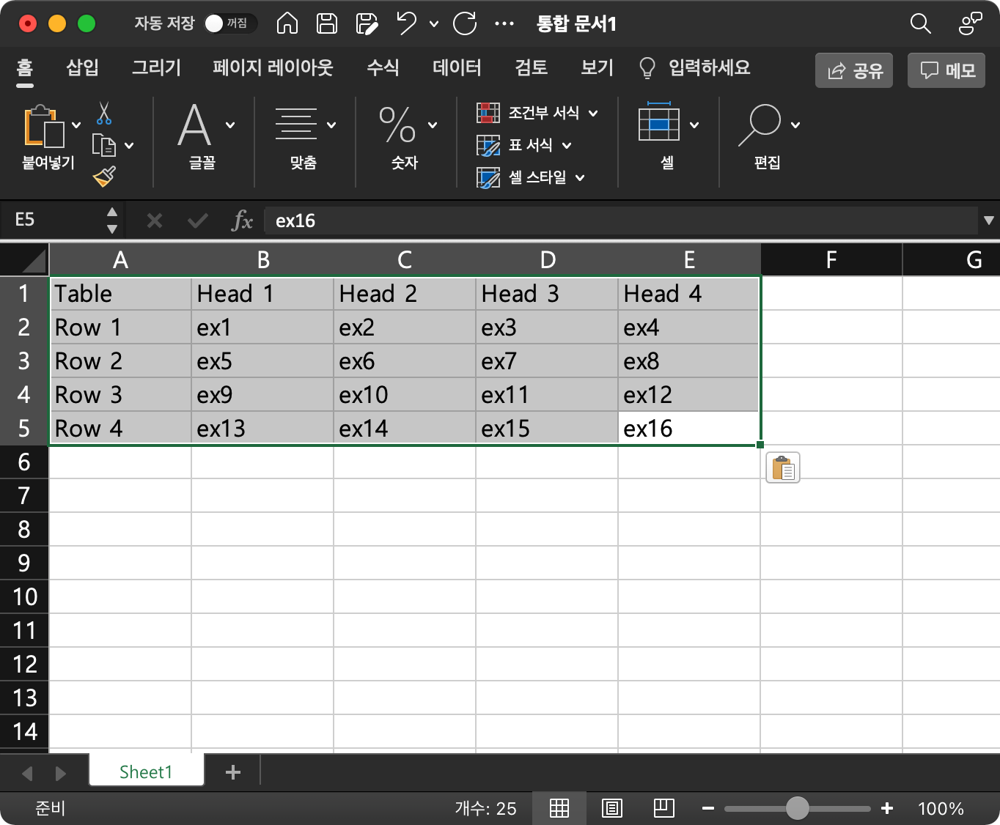
    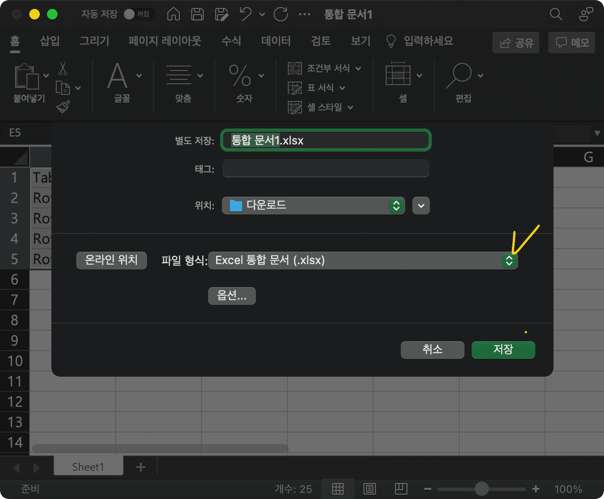
    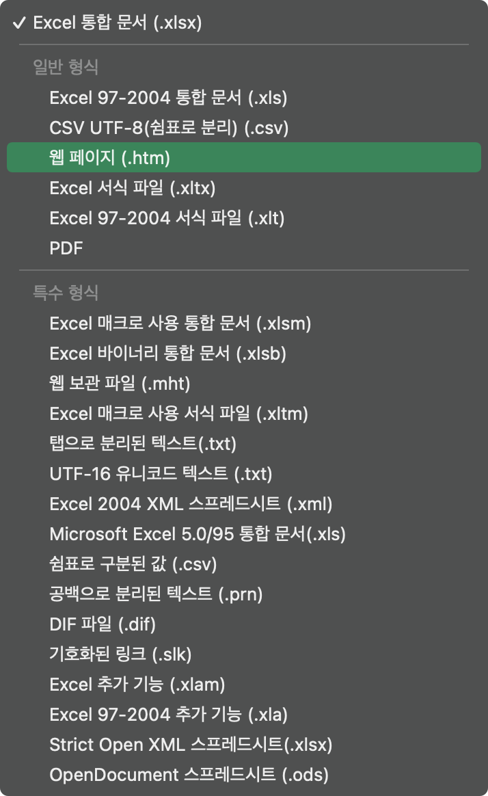
    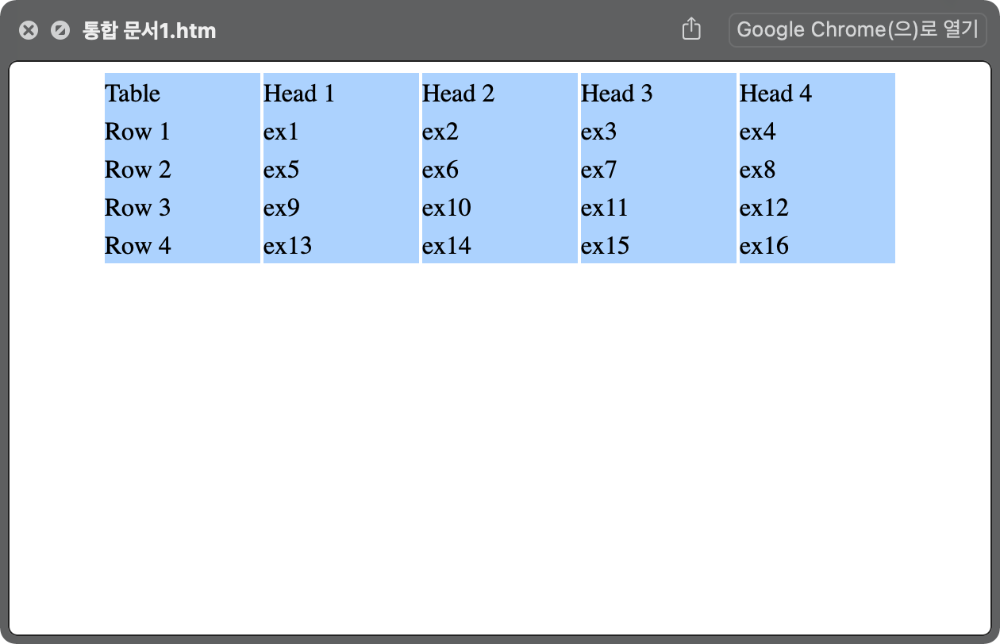
    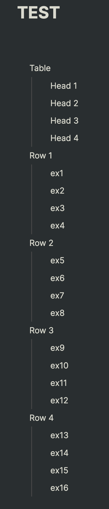
    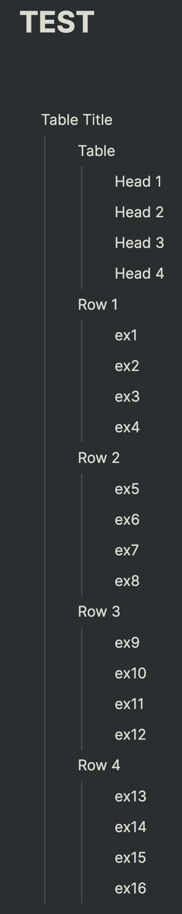
    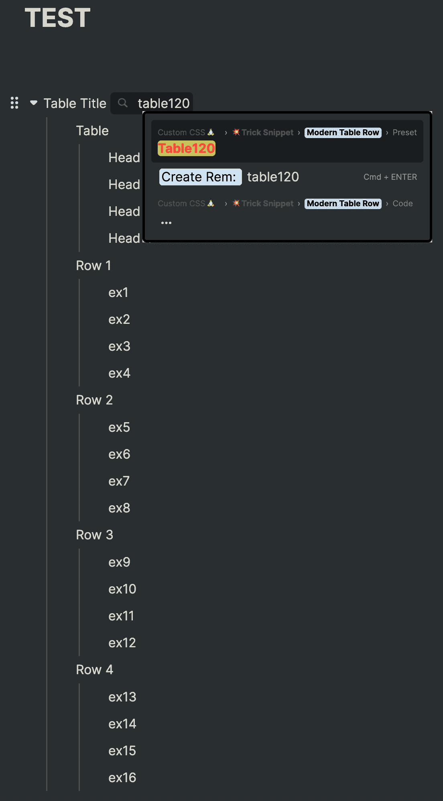
    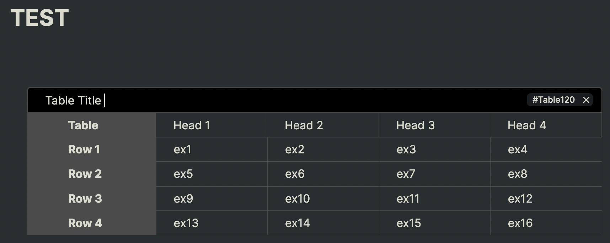
 </details>
 

 </details>

 ---

<!-- Modern Table Column -->
 <details>
 <summary>Modern Table Column</summary>

 ```css
 @import url("https://browneyedsoul.github.io/RemNote-CSS-Library/Modern%20Table%20Column.css");
 ```

 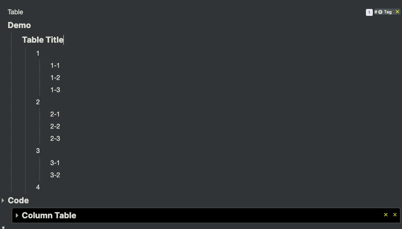
 </details>

 ---

<!-- Modern Kanban -->
 <details>
 <summary>Modern Kanban</summary>
 
 <div>
 <details>
    <summary>Modern Kanban1 - Inbox → In Progress → Done → Archive</summary>
 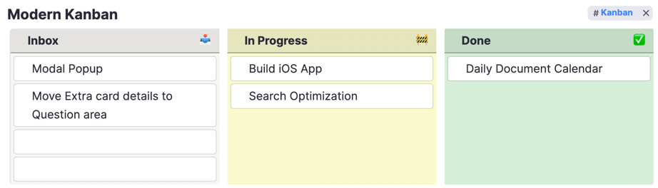

 ```css
 @import url("https://browneyedsoul.github.io/RemNote-CSS-Library/Modern%20Kanban.css");
 ```

 </details>
 </div>

 <div>
 <details>
    <summary>Modern Kanban2 - Fully Customizable</summary>
    
    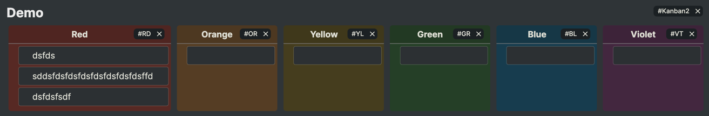

 ```css
 @import url("https://browneyedsoul.github.io/RemNote-CSS-Library/Modern%20Kanban2.css");
 ```

 </details>
 
 
 origin author : <a href="https://hannesfrank.github.io/remnote-library/#/scroll/com.github.hannesfrank.remnote-library.kanban-board">hannesfrank</a>
 </details>

 ---

<!-- Strikethrough Workaround -->
 <details>
 <summary>Strikethrough Workaround</summary>
 
 ```css
 @import url("https://browneyedsoul.github.io/RemNote-CSS-Library/Strikethrough.css");
 ```
 
 
 </details>
 
 ---

<!-- Caption -->
 <details>
 <summary>Caption</summary>
 
 ```css
 @import url("https://browneyedsoul.github.io/RemNote-CSS-Library/Image%2C%20Codeblock%20Caption%20like%20in%20Notion.css");
 ```
 
 
 </details>
 
 ---

<!-- Rating Bar -->
 <details>
 <summary>Rating bar</summary>
 
 ```css
 @import url("https://browneyedsoul.github.io/RemNote-CSS-Library/Prepositive%20Rating%20Bar.css"); 
 ```
 
 
 </details>
 
 ---

<!-- Cover Photo -->
  <details>
    <summary>Cover Photo</summary>

 ```css
 /* Please Copy the .css file (Template) and paste to your KB Directly */
 ```

 <div style="margin-left: 24px;">
    <details>
        <summary>Make a Cover Photo CSS Template</summary>
        <div style="margin-left: 24px;">
            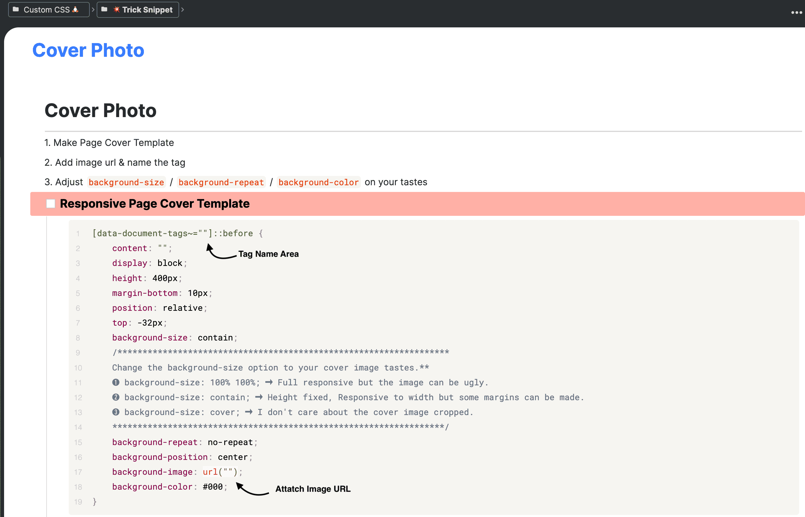
        </div>
    </details>
    <details>
        <summary>Add a image url, Name the tag</summary>
        <div style="margin-left: 24px;">
            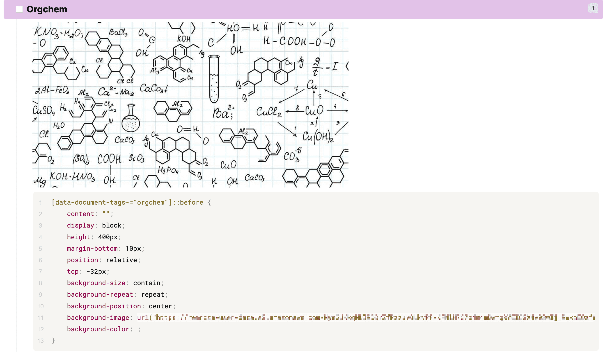
        </div>
    </details>
    <details>
        <summary>Tag to the Rem Document title area</summary>
        <div style="margin-left: 24px;">
            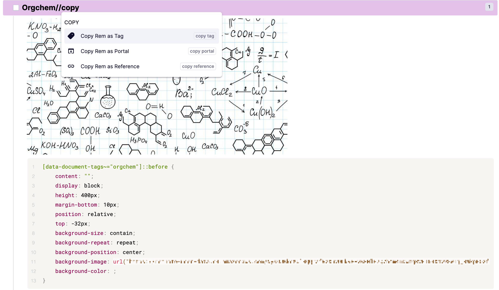
            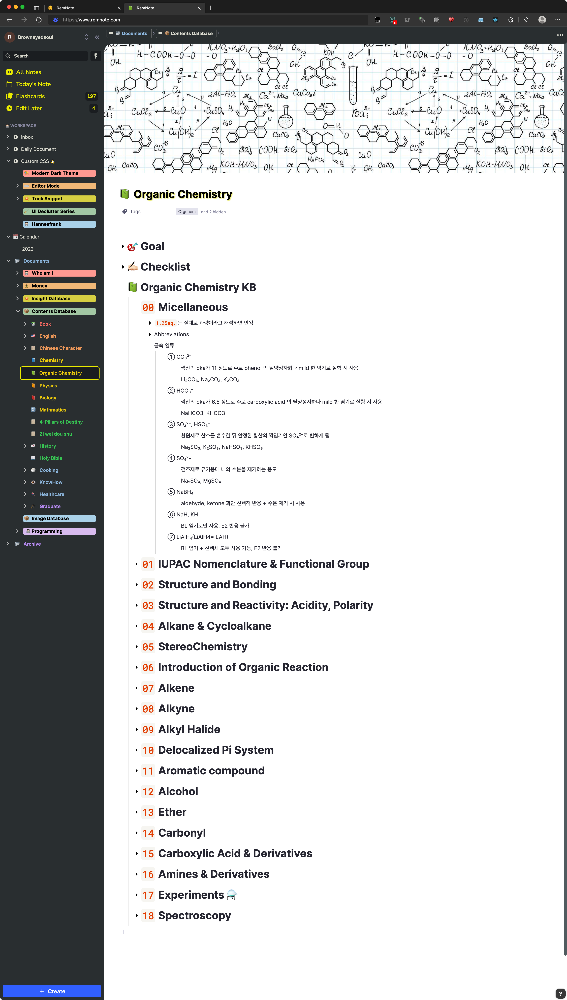
        </div>
    </details>
    <details>
        <summary>Adjust 'background-size' on your tastes.</summary>
        <div style="margin-left: 24px;">
            <br>➊ background-size: contain; <span style="font-weight: 700;">(Preferred)</span> ➞ Height fixed and Responsive. but some margins can be made (need something like background color or repetitive background.).
            <br>➋ background-size: 100% 100%; ➞ Full responsive but the image can be ugly.
            <br>➌ background-size: cover; ➞ I don’t care about the cover image cropped.
        </div>
    </details>
 </div>
 </details>

 ---

<!-- Terminal -->
 <details>
    <summary>Terminal</summary>

 ```css
 @import url("https://browneyedsoul.github.io/RemNote-CSS-Library/Terminal.css");
 ```

 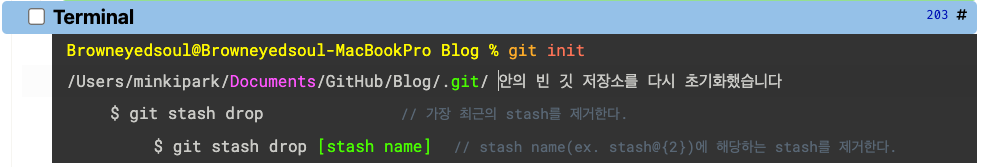
 </details>

 ---
 <br>
 <br>

# UI UX Declutter Series
<!-- Hide a Specific Tag -->
 <details>
    <summary>Hide a Specific Tag</summary>
  
 Sometimes, you can be bothered by meaningless tags like "th", "lb", ..., which are used for formatting reasons. 
 Then you can apply this code with a highlight color. In my case I chose the purple one and the code below is also running with purple colored rems.

 ```css
 .hierarchy-editor__tag-bar__tag.highlight-color--purple,
 .hierarchy-editor__tag-bar__tag.highlight-color--purple span {
 	display: none;
 }
 ```

 </details>

 ---

<!-- Hide Inline Source Permanently in Editor -->
 <details>
    <summary>Hide Inline Source Permanently in RemNote Hierarchical Editor</summary>

 ```css
 [data-rem-tags~="source-list"] .rem-container--focused > .inline-flex {
     display: none;
 }
 ```

 </details>

 ---

<!-- Hide Aliases until cursor hovered or focused -->
 <details>
    <summary>Hide Aliases until cursor hovered or focused</summary>

 

 ```css
 .tree-node-container > .tree-node--children > .tree-node-container[data-rem-container-tags~=aliases]:not(:hover):not(:focus-within) {
	display: block;
	background-color: #ECECEC;
	border-radius: 2px;
	max-height: 6px;
	overflow: hidden;
 }
 .dark-mode .tree-node-container > .tree-node--children > .tree-node-container[data-rem-container-tags~=aliases]:not(:hover):not(:focus-within) {
 	background-color: #272C30;
 }
 ```
 
 </details>

 ---

<!-- Rem Backlink Declutter -->
 <details>
    <summary>Rem Backlink Declutter</summary>

 > Sometimes, some rems don't need to represent all the backlinks.
 And If a rem shows a bunch of the backlinks, it slows down the paging

 - Example of the some rems: `caption`, `bulletlist`, `table`, `table90`, `table120`, `w360` ...

 ```css
 [data-rem-container-tags~="remover"] .animate-zoom-into-bullet #show-embedded-search-button,
 [data-rem-container-tags~="remover"] .animate-zoom-into-bullet #AutomaticSearchPortals,
 [data-rem-container-tags~="remover"] .rem-container--embedded-search-stub {
     display: none !important;
 }
 ```

 </details>

 ---

<!-- Hide Placeholder aka "Type / for Commands" -->
 <details>
    <summary>Hide Placeholder aka "Type / for Commands"</summary>
 
 

 ```css
 .rich-text-editor-placeholder {
     display: none;
 }
 ```

 </details>

 ---

<!-- Move Omni Help Button for Content Visibility : Declutter ? Button at the lower right -->
  <details>
    <summary>Move Omni Help Button for Content Visibility : Declutter ? Button at the lower right</summary>
  

  ```css
  #help-button {
	position: fixed;
	bottom: 4px;
	right: 4px;
	border-radius: 10px;
	color: #FFF;
	background-color: #404040;
 }
 .dark-mode #help-button {
	color: #000;
	background-color: #FFF;
 }
 #help-button:hover {
	background-color: #000;
 }
 .dark-mode #help-button:hover {
	background-color: #E0E0E0;
 }
 ```

 </details>

 ---

<!-- Disable inadvertent Bullet Click Event -->
 <details>
    <summary>Disable inadvertent Bullet Click Event</summary>

 ```css
 .rem-bullet__container {
	pointer-events: none;
 }
 ```

 </details>

 ---

<!-- Hide List Card Placeholder -->
 <details>
    <summary>Hide List Card Placeholder</summary>
 
 

 ```css
 [data-rem-tags="card-item"] .text-gray-20 {
	display: none;
 }
 ```

 </details>

 ---

<!-- Hide "Add a Document To This Folder" -->
 <details>
    <summary>Hide "Add a Document To This Folder"</summary>

 ```css
 #AddNewDocumentButtonSmall {
 	display: none;
 }
 ```

 </details>

 ---

<!-- Disable URL Link Popup when hovering website reference -->
 <details>
    <summary>Disable URL Link Popup when hovering website reference</summary>

 ```css
 .popup-menu > .p-1 {
	display: none;
 }
 ```

 </details>

 ---

<!-- Remove Document Top Blank line -->
 <details>
    <summary>Remove Document Top Blank line</summary>

 ```css
 .rn-add-rem-button--top {
	height: 10px;
	display: block;
 } 
 ```

 </details>

 ---
 <br>
 <br>

# The SUM of all the Theme and Snippets

<!-- The SUM of all the Theme and Snippets -->
 
 ```css
 /* Modern Dark Theme */
  @import url("https://browneyedsoul.github.io/RemNote-CSS-Library/Modern%20Dark%20Theme.css");
 /* Editor Mode */
  /* Notion like No Bullet Editor Mode */
   @import url("https://browneyedsoul.github.io/RemNote-CSS-Library/Notion%20like%20No%20Bullet%20Editor%20Mode.css"); 
  /* Branch Emphasizing Editor Mode(need to be polished) */
   /* @import url("https://browneyedsoul.github.io/RemNote-CSS-Library/"); */
 /* Tricks */
  /* Modern Scrollable Codeblock */
   @import url("https://browneyedsoul.github.io/RemNote-CSS-Library/Modern%20Scrollable%20Code%20Block.css");
  /* Rem Thumbnail */
   @import url("https://browneyedsoul.github.io/RemNote-CSS-Library/Rem%20Thumbnail.css");
  /* Notion like Callout Rem */
   @import url("https://browneyedsoul.github.io/RemNote-CSS-Library/Notion%20like%20Callout%20Rem.css");
  /* Modern Divider */
   @import url("https://browneyedsoul.github.io/RemNote-CSS-Library/Modern%20Divider.css"); 
  /* Active Recall */
   @import url("https://browneyedsoul.github.io/RemNote-CSS-Library/Active%20Recall.css");
     /* @import url("https://browneyedsoul.github.io/RemNote-CSS-Library/Active%20Recall2.css"); */
     /* @import url("https://browneyedsoul.github.io/RemNote-CSS-Library/Active%20Recall3.css"); */
  /* Rem Planner */
   @import url("https://browneyedsoul.github.io/RemNote-CSS-Library/Planner.css");
  /* Rem Tree */
   @import url("https://browneyedsoul.github.io/RemNote-CSS-Library/Rem%20Tree.css");
  /* Blockquote */
   @import url("https://browneyedsoul.github.io/RemNote-CSS-Library/Blockquote.css");
  /* Modern Table Row */
   @import url("https://browneyedsoul.github.io/RemNote-CSS-Library/Modern%20Table%20Row.css");
  /* Modern Table Column */
   @import url("https://browneyedsoul.github.io/RemNote-CSS-Library/Modern%20Table%20Column.css");
  /* Modern Kanban */
   @import url("https://browneyedsoul.github.io/RemNote-CSS-Library/Modern%20Kanban.css");
  /* Easily Discernible List Card Layout */
   /* @import url("https://browneyedsoul.github.io/RemNote-CSS-Library/Easily%20Discernible%20List%20Card%20Layout.css"); */
  /* Easily Discernible Inline Card Layout */
   @import url("https://browneyedsoul.github.io/RemNote-CSS-Library/Easily%20Discernible%20Inline%20Card%20layout.css");
  /* Strikethrough Workaround */
   @import url("https://browneyedsoul.github.io/RemNote-CSS-Library/Strikethrough.css");
  /* Caption */
   @import url("https://browneyedsoul.github.io/RemNote-CSS-Library/Image%2C%20Codeblock%20Caption%20like%20in%20Notion.css");
  /* Rating Bar */
   @import url("https://browneyedsoul.github.io/RemNote-CSS-Library/Prepositive%20Rating%20Bar.css"); 
  /* Terminal */
   @import url("https://browneyedsoul.github.io/RemNote-CSS-Library/Terminal.css");
 ```
